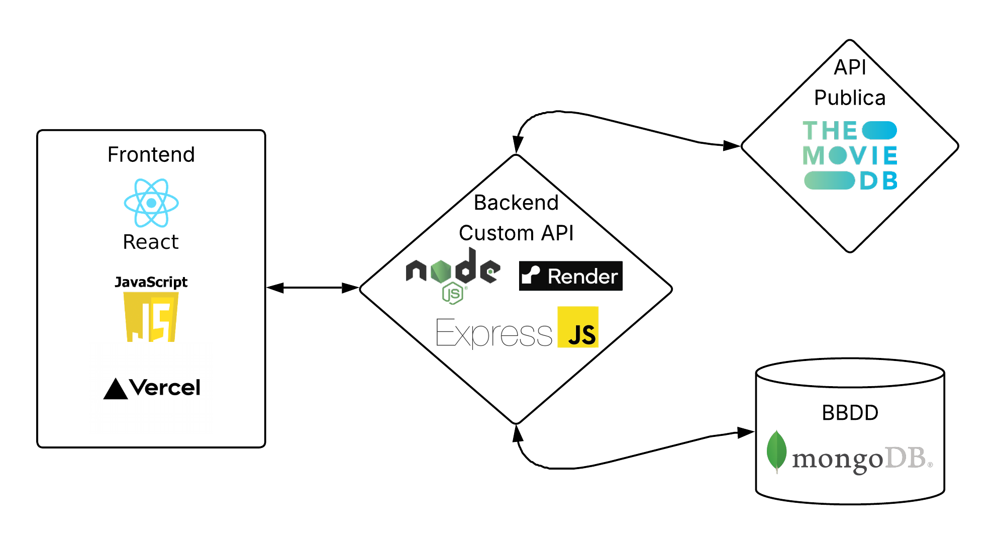

# Consultor de Películas y Series

Aplicación web para consultar, buscar y gestionar información sobre películas y series, permitiendo a los usuarios crear su propia galería personal, dejar comentarios y descubrir contenido a través de la API de TMDB.

**Desarrollador:** Juan Carlos Pérez Sánchez

## Características principales

- Explora películas y series populares, filtrando por género.
- Busca títulos específicos mediante el buscador integrado.
- Consulta detalles completos de cada título: sinopsis, reparto, tráilers, plataformas de streaming, etc.
- Guarda tus películas y series favoritas en tu galería personal (requiere registro).
- Deja comentarios y reseñas en cada ficha de contenido.
- Interfaz moderna, adaptable y fácil de usar.
- Backend con autenticación JWT, gestión de usuarios, galería y comentarios.
- Consumo de la API pública de [The Movie Database (TMDB)](https://www.themoviedb.org/).

## Tecnologías utilizadas

- **Frontend:** React, React Router, CSS Modules, React Icons
- **Backend:** Node.js, Express, MongoDB, Mongoose, JWT, dotenv
- **APIs:** TMDB (The Movie Database)
- **Testing:** Jest, Supertest

<p align="center">
    
</p>
<p align="center">
    
</p>

## Requisitos previos

- Node.js >= 18.x
- MongoDB en local o en la nube (Atlas)
- Clave de API de TMDB ([solicitar aquí](https://www.themoviedb.org/settings/api))

## Instalación

### 1. Clona el repositorio

```sh
git clone https://github.com/tuusuario/DAW-TFG.git
cd DAW-TFG
```

### 2. Configura el backend

```sh
cd consultorpeliculasyseries/backend
cp .env.template .env
# Edita .env y rellena PORT, MONGODB_URL, SECRET_KEY, TMDB_API_KEY, TMDB_BASE_URL con tus datos
npm install
```

### 3. Configura el frontend

```sh
cd ../frontend
cp .env.template .env
# Edita .env y pon en "REACT_APP_API_BASE_URL=" la URL de tu backend
npm install
```

## Ejecución en desarrollo

### Backend

```sh
cd consultorpeliculasyseries/backend
node src/app.js o npm run dev
# node src/app.js aconsejado para Producción y npm run dev para desarrollo
```

### Frontend

```sh
cd consultorpeliculasyseries/frontend
npm start
```

- Accede a la web en [http://localhost:3000](http://localhost:3000)
- El backend debe estar corriendo en [http://localhost:5000](http://localhost:5000)

## Scripts útiles

- `npm start` (frontend): Inicia la app React en modo desarrollo.
- `npm run dev` (backend): Inicia el backend con nodemon.
- `npm test` (backend): Ejecuta los tests unitarios y de integración.

## Estructura del proyecto

```
DAW-TFG/
│
├── consultorpeliculasyseries/
│   ├── backend/
│   │   ├── src/
│   │   │   ├── controllers/
│   │   │   │   ├── commentController.js
│   │   │   │   ├── tmdbController.js
│   │   │   │   └── usersAndAuthController.js
│   │   │   ├── dtos/
│   │   │   │   ├── CommentDTO.js
│   │   │   │   ├── GalleryDTO.js
│   │   │   │   └── UserDTO.js
│   │   │   ├── loaders/
│   │   │   │   ├── express.js
│   │   │   │   └── mongoose.js
│   │   │   ├── middlewares/
│   │   │   │   └── authMiddleware.js
│   │   │   ├── models/
│   │   │   │   ├── Comment.js
│   │   │   │   ├── Gallery.js
│   │   │   │   └── User.js
│   │   │   ├── openapi/
│   │   │   │   └── openapi.yaml
│   │   │   ├── routes/
│   │   │   │   ├── commentRoutes.js
│   │   │   │   ├── generalsRoutes.js
│   │   │   │   ├── tmdbRoutes.js
│   │   │   │   └── usersRoutes.js
│   │   │   ├── schemas/
│   │   │   │   ├── CommentSchema.js
│   │   │   │   ├── GallerySchema.js
│   │   │   │   └── UserSchema.js
│   │   │   ├── services/
│   │   │   │   └── tmdbService.js
│   │   │   ├── utils/
│   │   │   │   ├── hashPasswordManager.js
│   │   │   │   └── tokenManager.js
│   │   │   └── app.js
│   │   ├── tests/
│   │   │   ├── e2e/
│   │   │   │   ├── comments.e2e.test.js
│   │   │   │   ├── gallery.e2e.test.js
│   │   │   │   ├── tmdb.e2e.test.js
│   │   │   │   └── usersAndAuth.e2e.test.js
│   │   │   └── unit/
│   │   │       ├── CommentDTO.unit.test.js
│   │   │       ├── GalleryDTO.unit.test.js
│   │   │       ├── hashPasswordManager.unit.test.js
│   │   │       ├── tokenManager.unit.test.js
│   │   │       └── UserDTO.unit.test.js
│   │   ├── .env
│   │   ├── .env.template
│   │   ├── .eslintrc.json
│   │   ├── .gitignore
│   │   ├── babel.config.js
│   │   ├── Dockerfile
│   │   ├── jest.config.js
│   │   ├── package-lock.json
│   │   └── package.json
│   │
│   └── frontend/
│       ├── public/
│       │   ├── Curriculum/
│       │   │   ├── Currículum en Español.pdf
│       │   │   └── Curriculum vitae in English.pdf
│       │   ├── icons/
│       │   │   └── principal_icon.png
│       │   ├── images/
│       │   │   └── placeholder_image.png
│       │   ├── index.html
│       │   └── manifest.json
│       ├── src/
│       │   ├── components/
│       │   │   ├── CommentsChat/
│       │   │   │   ├── CommentsChat.css
│       │   │   │   ├── CommentsChat.jsx
│       │   │   │   ├── CommentsChatDTO.js
│       │   │   │   └── CommentsChatService.js
│       │   │   ├── ContentCard/
│       │   │   │   ├── ContentCard.css
│       │   │   │   └── ContentCard.jsx
│       │   │   ├── Footer/
│       │   │   │   ├── Footer.jsx
│       │   │   │   └── Footer.css
│       │   │   ├── GalleryButton/
│       │   │   │   ├── GalleryButton.css
│       │   │   │   ├── GalleryButton.jsx
│       │   │   │   └── GalleryButtonService.js
│       │   │   ├── Header/
│       │   │   │   ├── Header.css
│       │   │   │   ├── Header.jsx
│       │   │   │   └── HeaderService.js
│       │   │   └── GlobalSessionWatcher.jsx
│       │   ├── pages/
│       │   │   ├── AboutTheWebPage/
│       │   │   │   ├── AboutTheWebPage.css
│       │   │   │   └── AboutTheWebPage.jsx
│       │   │   ├── ApiInfoPage/
│       │   │   │   ├── ApiInfoPage.css
│       │   │   │   └── ApiInfoPage.jsx
│       │   │   ├── DetailsPage/
│       │   │   │   ├── DetailsPage.css
│       │   │   │   ├── DetailsPage.jsx
│       │   │   │   ├── DetailsPageDTO.js
│       │   │   │   └── DetailsPageService.js
│       │   │   ├── DeveloperPage/
│       │   │   │   ├── DeveloperPage.css
│       │   │   │   └── DeveloperPage.jsx
│       │   │   ├── GalleryPage/
│       │   │   │   ├── GalleryPage.css
│       │   │   │   ├── GalleryPage.jsx
│       │   │   │   ├── GalleryPageDTO.js
│       │   │   │   └── GalleryPageService.js
│       │   │   ├── HomePage/
│       │   │   │   ├── HomePage.css
│       │   │   │   ├── HomePage.jsx
│       │   │   │   ├── HomePageDTO.js
│       │   │   │   └── HomePageService.js
│       │   │   ├── LoginPage/
│       │   │   │   ├── LoginPage.jsx
│       │   │   │   └── LoginPageService.js
│       │   │   ├── MoviesPage/
│       │   │   │   ├── MoviesPage.css
│       │   │   │   ├── MoviesPage.jsx
│       │   │   │   ├── MoviesPageDTO.js
│       │   │   │   └── MoviesPageService.js
│       │   │   ├── RegisterPage/
│       │   │   │   ├── RegisterPage.jsx
│       │   │   │   └── RegisterPage.js
│       │   │   ├── RequireAuthPage/
│       │   │   │   ├── RequireAuthPage.css
│       │   │   │   ├── RequireAuthPage.jsx
│       │   │   │   └── RequireAuthPageService.js
│       │   │   ├── SearchResultsPage/
│       │   │   │   ├── SearchResultsPage.css
│       │   │   │   ├── SearchResultsPage.jsx
│       │   │   │   ├── SearchResultsPageDTO.js
│       │   │   │   └── SearchResultsPageService.js
│       │   │   ├── SeriesPage/
│       │   │   │   ├── SeriesPage.css
│       │   │   │   ├── SeriesPage.jsx
│       │   │   │   ├── SeriesPageDTO.js
│       │   │   │   └── SeriesPageService.js
│       │   ├── services/
│       │   │   ├── AppService.js
│       │   │   └── UtilsService.js
│       │   ├── styles/
│       │   │   ├── general.css
│       │   │   └── LoginAndRegister.css
│       │   ├── test/
│       │   │   ├── App.test.js
│       │   │   ├── DetailsPage.test.js
│       │   │   ├── GalleryPage.test.js
│       │   │   ├── HomePage.test.js
│       │   │   ├── LoginPage.test.js
│       │   │   ├── RegisterPage.test.js
│       │   │   ├── SearchResultsPage.test.js
│       │   │   └── StaticPages.test.js
│       │   ├── App.css
│       │   ├── App.js
│       │   ├── index.css
│       │   ├── index.js
│       │   └── setupTests.js
│       ├── .env
│       ├── .env.template
│       ├── .gitignore
│       ├── package-lock.json
│       ├── package.json
│       └── README.md
├── Recursos/
│   └── images/
└── Readme.md
```
